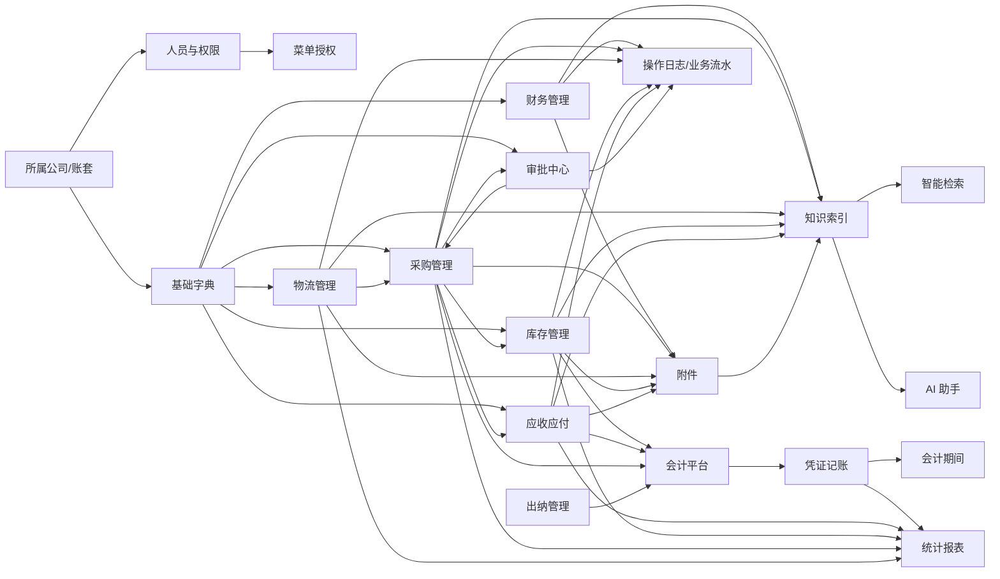
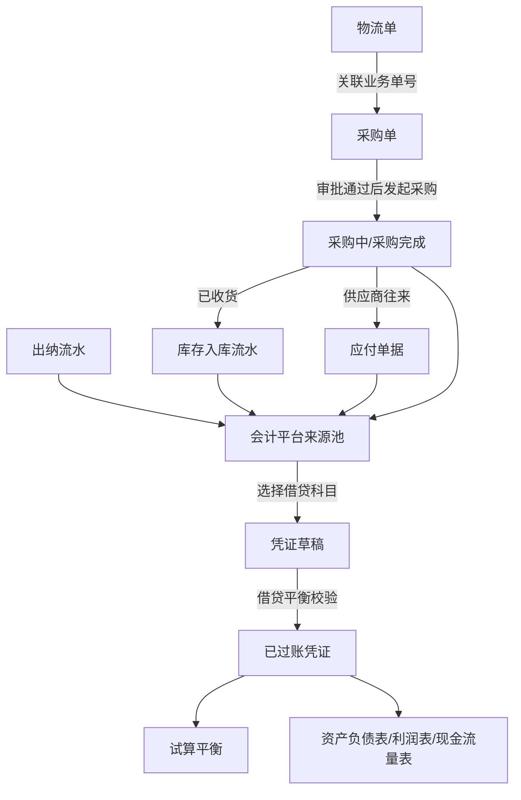
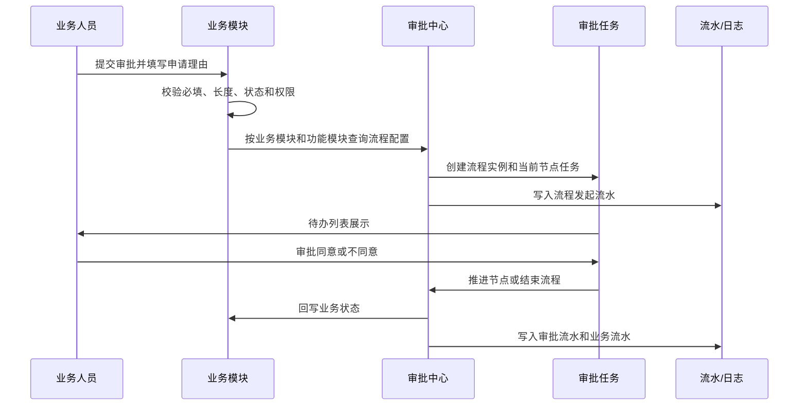

# Ratel FM 产品设计文档

版本日期：2026-07-20

开发组织：ratel  
开发人员：WenZhang  
联系方式：18782945613

## 1. 产品定位

Ratel FM 是面向中小型企业和个人账套场景的财务管理 ERP。系统把财务核算、采购、物流、库存、应收应付、审批、附件、日志审计、智能检索和 AI 助手放在同一套轻量化平台中，目标是在单机或小范围局域网部署条件下完成业务记录、财务追溯和经营分析。

当前产品已经从单一记账系统扩展为“基础信息 + 财务核算 + 业务协同 + 审批中心 + AI 助手”的一体化系统。产品设计以当前代码中已经存在的功能为准，后续需求变更应同步更新本文档。

## 2. 设计目标

- 单机可部署：默认支持 H2 文件数据库，程序启动即可使用，适合 Windows 笔记本部署。
- 多账套隔离：通过所属公司字典形成账套维度，登录、人员、业务数据、附件目录和查询均按所属公司隔离。
- 业务财务一体化：采购、库存、应收应付、出纳流水可作为会计平台制证来源。
- 可追溯：业务单据、状态流转、审批、附件和操作日志均保留历史记录。
- 可授权：菜单覆盖模块、页面、按钮，前端显隐和后端权限兜底同时生效。
- 可扩展：字典、菜单、流程定义、流程配置、知识库和 AI 模型配置均可独立扩展。

## 3. 用户角色

| 角色 | 主要诉求 | 典型功能 |
| --- | --- | --- |
| 系统管理员 | 维护账套、人员、角色、菜单、基础字典和系统配置 | 人员管理、角色管理、菜单管理、字典管理 |
| 财务主管 | 维护会计科目、审核账务、查看报表和经营概览 | 科目、凭证、会计期间、会计平台、报表 |
| 会计 | 日常凭证录入、过账、作废、制证和附件归档 | 凭证记账、会计平台、附件 |
| 出纳 | 记录收款、付款、转账、调账和资金确认 | 出纳管理 |
| 采购人员 | 创建采购单、提交审批、发起采购、收货和取消采购 | 采购管理、审批中心 |
| 物流人员 | 维护运输信息、确认物流状态、查看物流流水 | 物流管理 |
| 库存人员 | 记录入库、出库、调拨、盘点并查看物料库存 | 库存台账、物料库存 |
| 往来会计 | 维护应收应付、核销收付款、查看收付统计 | 应收应付、收付统计 |
| 审批人员 | 处理待办、查看已办和自己发起的审批 | 审批中心 |
| 审计人员 | 查询关键操作、登录行为和业务影响 | 日志管理 |
| 经营管理者 | 查看概览、报表、常用入口和智能检索结果 | 首页概览、统计报表、AI 助手 |

## 4. 产品导航

当前前端页面路由和菜单编码已经覆盖以下页面：

| 模块 | 页面 |
| --- | --- |
| 首页概览 | 财务工作台 |
| 基础信息 | 人员管理、角色管理、菜单管理、字典管理 |
| 财务管理 | 会计科目、凭证记账、会计期间、出纳管理、会计平台 |
| 业务管理 | 采购管理、物流管理 |
| 库存管理 | 库存台账、物料库存 |
| 应收应付 | 应收应付、收付统计 |
| 审批中心 | 审批中心、流程管理、流程定义 |
| 统计报表 | 试算平衡、资产负债表、利润表、现金流量表 |
| 智能检索 | 智能检索、AI 助手、AI 状态 |
| 日志管理 | 操作日志 |

左侧菜单不写死模块层级，而是按菜单管理中的模块、页面层级渲染。首页概览作为独立模块靠前展示，统计报表靠后展示，日志管理最后展示。AI 助手归属智能检索模块，同时右下角提供悬浮 AI 助手入口。

## 5. 模块关系与数据流向

### 5.1 模块关系总览

Ratel FM 的模块关系以“基础信息和账套”为底座，以“业务单据”为来源，以“财务核算”为归集，以“审批、附件、日志、AI”为横向支撑。

### 5.2 基础数据流向

基础信息模块向业务模块提供统一字典和权限基础，业务模块保存编码、名称和级联快照，避免字典改名后历史单据失真。

| 来源模块 | 流向模块 | 数据内容 | 使用方式 |
| --- | --- | --- | --- |
| 所属公司字典 | 登录、人员、全部业务模块 | 公司编码、公司名称 | 登录选择账套，后端按当前账套隔离数据 |
| 人员管理 | 审批、日志、业务单据 | 用户、部门、岗位、联系方式 | 审批人匹配、操作人快照、业务创建人 |
| 菜单管理 | 前端导航、后端权限 | 模块、页面、按钮、权限码 | 前端显隐，后端接口兜底 |
| 项目字典 | 凭证、采购、物流、库存、应收应付、审批 | 项目编码、项目名称 | 单据项目维度、统计筛选、审批查询 |
| 物料字典 | 采购、库存 | 物料编码、物料名称、级联名称 | 采购明细、库存流水、物料库存统计 |
| 仓库字典 | 库存 | 仓库编码、仓库名称 | 入库、出库、调拨、盘点 |
| 客户/供应商字典 | 采购、应收应付 | 往来单位编码和名称 | 采购供应商、收付统计 |
| 行政区划字典 | 物流 | 区划编码、完整级联名称 | 发货地、目的地、右 like 查询下级 |
| 币种字典 | 凭证、采购、应收应付 | 币种、汇率、人民币金额 | 行级币种和汇率快照 |

### 5.3 业务到财务数据流向

业务数据进入财务核算时不直接覆盖原单据，而是通过会计平台生成凭证草稿，保留来源单号和来源类型。

### 5.4 审批数据流向

当前采购管理已经接入流程审批，其他模块可按功能模块代码复用同一机制。

### 5.5 附件、日志和知识数据流向

附件、日志和知识索引不是独立业务入口，而是横向支撑所有核心单据。

| 横向能力 | 输入来源 | 输出去向 | 目的 |
| --- | --- | --- | --- |
| 附件 | 凭证、采购、物流、库存、应收应付 | 文件目录、附件表、业务附件关联表 | 保存证据文件并支持预览下载 |
| 数据库操作日志 | 登录、基础信息、业务操作、审批 | 日志管理 | 追踪谁在何时做了什么操作 |
| 业务操作流水 | 凭证、采购、物流、库存、应收应付 | 右侧时间轴抽屉 | 展示单据生命周期和历史快照 |
| 知识索引 | 系统说明、业务单据、附件文本、本地知识库 | H2 或 Qdrant | 支撑智能检索和 AI 助手 |
| 统计报表 | 凭证、采购、库存、应收应付、出纳 | 首页概览、统计报表 | 汇总经营与财务指标 |

## 6. 基础信息与账套

### 6.1 所属公司与账套

所属公司由 `ORGANIZATION` 字典维护，作为账套列表。登录时必须选择所属公司，后端按所属公司校验账号或身份证号与密码。登录成功后所属公司写入 Cookie/JWT，上层接口不要求前端手工传递公司参数。

数据隔离规则：

- 人员账号、身份证号在同一所属公司内唯一，不同所属公司可重复。
- 会计科目、凭证、采购、物流、库存、应收应付、出纳、审批、日志和附件均按所属公司过滤。
- 附件物理目录最上层按 `所属公司代码_所属公司名称` 区分。
- 只有默认 `admin` 能维护所属公司字典，并能在人员管理中选择人员所属公司。

### 6.2 字典管理

字典管理是所有基础资料的统一入口，支持任意层级。

当前核心字典：

- 所属公司：`ORGANIZATION`
- 项目：`PROJECT`
- 部门：`DEPARTMENT`
- 组织：`ORG_UNIT`
- 岗位：`POSITION`
- 采购方：`SUPPLIER`
- 物流方：`CARRIER`
- 物料：`MATERIAL`
- 仓库：`WAREHOUSE`
- 客户/供应商：`PARTNER`
- 币种：`CURRENCY`
- 行政区划：`ADMINISTRATIVE_DIVISION`
- 取消类型、结算方式、付款条件、计量单位等业务辅助字典

字典规则：

- 字典 code 非必填，未填写时服务端生成随机唯一编码。
- 同一父级下字典名称唯一，不同层级允许重名。
- 禁用字典不再出现在业务下拉框，历史单据保留名称快照。
- 树型展示默认只展开第一层。
- 上下级选择不能选择自身或自身下级作为父级。
- 级联类字典后端保存完整级联编码和名称，前端展示完整名称；搜索支持右 like 查询下级。

### 6.3 全国行政区划

系统内置全国行政区划 CSV 数据，覆盖省、市、区县、乡镇街道四级。行政区划作为字典使用，物流发货区划和目的区划保存完整级联关系，搜索条件支持多选和右 like 查询，从而支持选择“北京”查询北京及其下级区划数据。

## 7. 人员、登录与权限

### 7.1 登录

登录页面包含默认登录页 `/ratel/fm/login` 和星空登录页 `/ratel/fm/login/star`。登录参数包含所属公司、账号或身份证号、密码、终端类型和终端标识。

登录规则：

- JWT 写入 HttpOnly Cookie。
- JWT 有效期 1 小时，距离过期不足半小时自动续期。
- 请求时校验令牌签名、过期时间、人员状态、人员信息一致性、会话状态和终端信息。
- 同一所属公司、同一身份证号、同一终端类型只允许一个有效登录。
- 后登录发现已有登录时，前端提示是否挤掉前登录者。
- 登录成功、失败、重复登录提醒、强制登录均写入操作日志。

### 7.2 人员管理

人员管理支持新增、编辑、删除、批量删除、密码修改、头像上传和搜索。人员基础字段包括账号、姓名、身份证号、手机号、邮箱、头像、部门、组织、岗位、所属公司和启停状态。

校验规则：

- 姓名限制 20 个中文字符。
- 手机号或座机号按联系方式规则校验。
- 身份证号校验 18 位中国居民身份证。
- 头像只能上传 jpg、jpeg、png、webp 图片，大小限制 2MB。

### 7.3 角色与菜单授权

菜单资源分为模块、页面、按钮三级。人员关联角色，角色关联菜单。角色授权选择子级菜单时自动补齐上级。登录成功和页面刷新后，前端重新请求授权菜单编码和授权菜单资源，动态渲染左侧菜单和按钮。

后端仍通过权限码做接口兜底，避免只依赖前端显隐。

## 8. 财务管理

### 8.1 会计科目

会计科目按树型层级展示，默认只展开第一层。系统启动时读取会计科目 CSV 初始化标准科目。科目支持编码、名称、类别、父级、启停和说明。

核心规则：

- 分类根节点和存在下级的科目只用于组织树，不允许入账。
- 凭证和会计平台只能选择启用的叶子科目。
- 停用父级时如存在启用下级，需要二次确认。
- 停用后业务选择不展示该节点及其下级。
- 修改父级不能选择自身或自身下级。

### 8.2 凭证记账

凭证支持新增、编辑、详情、过账、作废、批量删除、导出、查看流水、生成在线凭证图片、附件管理和 AI 图片识别导入。

凭证字段：

- 凭证日期、所属年月、项目、摘要、来源单号、状态。
- 分录行包含会计科目、摘要、借方金额、贷方金额、币种、汇率、人民币金额。

金额规则：

- 金额和汇率保留 8 位小数。
- 每行明细单独选择币种和汇率。
- 非人民币币种可自动获取最新参考汇率，用户可手工修改。
- 保存业务发生时的汇率和人民币金额快照，后续统计不依赖实时汇率。
- 整张凭证按人民币金额校验借贷平衡。

### 8.3 会计期间

会计期间支持创建自然月期间、月结检查、关闭期间和反结账。月结检查会提示本期草稿凭证、未结清往来等风险。

### 8.4 出纳管理

出纳管理维护收款、付款、转账、调账流水，支持确认、取消、批量删除、导出，并可作为会计平台资金类制证来源。

### 8.5 会计平台

会计平台统一读取采购单、应收应付单、库存流水和出纳流水作为制证来源。财务人员选择借贷科目、摘要和业务来源后生成凭证草稿，并保留来源单号、项目、币种、金额和来源链路。

## 9. 业务管理

### 9.1 采购管理

采购单包含供应商、项目、采购日期、明细、金额、附件、状态和操作流水。

采购状态：

- 草稿：可编辑、提交审批、查看详情、查看流水。
- 审批中：只保留详情和查看流水。
- 已审批不同意：可重新编辑和提交审批。
- 已审批同意：可发起采购、取消采购。
- 采购中：可确认已收货或取消采购。
- 采购完成：只保留详情和查看流水。
- 取消采购：只保留详情和查看流水。

采购审批：

- 提交审批前校验必填、长度和正则。
- 提交时填写申请理由并发起流程实例。
- 审批通过后进入可发起采购状态。
- 审批不同意后允许继续编辑。
- 各状态变化记录操作流水。

采购收货：

- 已收货时可弹出库存台账新增流水模态框。
- 可自动填充采购单中已有的项目、物料、数量、金额等信息，缺失内容由用户补充。

### 9.2 物流管理

物流单包含项目、关联业务单号、承运商、运输方式、承运信息、发货区划、发货详址、目的区划、目的详址、计划/实际发运、实际送达、状态、附件和操作流水。

物流状态具有顺序性，不能回退。草稿或已创建状态可编辑，进入后续状态后隐藏编辑按钮。已送达或已取消后不能再编辑或状态确认。

每次状态确认会弹出模态框回显最新物流信息，用户可修正实际信息后确认，并生成物流操作流水。查看流水以右侧抽屉时间轴方式展示，按时间倒序分页，支持操作时间范围搜索。

## 10. 库存管理

库存台账支持入库、出库、调拨、盘点流水，项目、物料、仓库均来自基础字典。列表支持搜索、导出、批量删除、附件和查看流水。

库存数量规则：

- 库存数量 = 入库总数 - 出库总数 - 调拨总数。
- 出库和调拨时，数量不能大于当前库存数量。
- 物料库存页面按物料字典层级统计各物料库存。
- 物料编码和物料名称在页面合并为物料选择，业务表保存编码、名称和级联快照。

## 11. 应收应付

应收应付管理客户/供应商往来单据，支持项目、客户/供应商、应收、应付、已收、已付、待收、待付、账龄、付款计划、附件、导出、批量删除和查看流水。

收付统计位于应收应付模块内，以 tab 或子页面方式展示。筛选条件包括项目和客户/供应商，统计每个单号的应收、应付、待收、待付金额，并汇总全部金额。导出文件名称按“收付统计_项目名称_客户供应商名称_当前时间”生成，空条件不产生多余下划线。

## 12. 审批中心

审批中心包含三个列表：

- 待办事宜：当前用户待审批任务，可审批和查看流程。
- 已办事宜：当前用户审批过的流程，可查看流程。
- 发起事宜：当前用户发起的流程，可查看流程。

列表字段包含业务模块、功能模块、项目、审批标题、发起人、申请时间、当前节点、流程状态、下个节点审批人。搜索条件包含业务模块、标题、项目、申请时间范围、发起人姓名、流程状态。

流程查看包含：

- 流程示意图，已走过节点绿色展示，待审批节点清晰标识。
- 流程业务表单预览区域，兼容不同业务模块表单。
- 流程操作流水，时间展示在左侧时间线上。
- 审批人展示姓名和联系方式，审批意见前缀明确。
- 审批人组合展示为“人员：张三”“部门：管理部”“部门(岗位)：管理部(经理)”。

流程管理按所属公司、业务模块、功能模块配置流程模板。流程定义支持节点和审批人维护，审批人可以是指定人员、部门或部门岗位。

审批操作保留同意和不同意，审批意见必填，默认同意意见为“同意申请”。

## 13. 统计报表与首页概览

首页概览展示财务工作台信息，包含风险提醒、快捷入口、待办中心、月结检查和核心指标。默认自动刷新，打开自动刷新后隐藏手动刷新按钮，并按 5 秒周期请求概览数据。

快捷入口记录每个用户点击进入功能菜单的次数，按常用次数展示前 10 个功能。

统计报表包含：

- 试算平衡表。
- 资产负债表。
- 利润表。
- 现金流量表。

## 14. 附件与文件预览

凭证、采购、物流、库存、应收应付等模块支持附件列表。附件支持上传、重命名、删除、下载和在线预览。

文件管理规则：

- 附件元数据统一保存到附件表。
- 业务与附件通过关联表维护。
- 物理文件保存到运行包 `files` 目录。
- 最上层目录按所属公司区分。
- 小体量文件支持在线预览。

## 15. 日志管理

系统同时保留文件日志和数据库操作日志。

文件日志：

- 关键业务操作写入日志文件。
- 日志按天滚动，单文件达到限制后压缩。
- 系统日志保留时间按配置自动清理。

数据库操作日志：

- 登录、人员、权限、字典、凭证、采购、物流、库存、应收应付、审批等关键操作写入数据库。
- 数据库日志写入异常不能影响主业务流程。
- 日志管理页面默认查询最近一个月。
- 列表隐藏执行结果、参数、响应值等大字段，需要时再查看。
- 搜索条件包括操作时间范围、账号、身份证、联系方式、部门、终端类型、终端标识。

## 16. 智能检索与 AI 助手

智能检索覆盖系统业务数据、附件文本、本地知识库和必要模块说明。检索结果需要经过权限和账套过滤。

AI 助手能力：

- 右下角悬浮 AI 助手图标。
- AI 助手页面和悬浮对话框均可使用，AI 助手页面包含“助手问答”“业务 Agent”“本地知识库”三个页签。
- 支持系统上下文、业务知识库和最近对话摘要。
- 支持 SSE 流式输出，异常时可回退非流式接口。
- 支持互联网检索开关和本地知识库检索。
- 支持 AI 状态页面查看 Ollama、Qdrant、embedding、模型可用性等状态。
- 支持图片 OCR 和凭证识别导入，优先本地视觉模型，必要时按配置回退云端视觉能力。
- ratel助手识别到对账、到期、制证建议、库存风险等意图时，可自动进入业务 Agent 分析。

向量检索：

- 通过配置选择 H2 内置向量库或 Qdrant。
- Qdrant 不可用时可按配置降级或提示。
- embedding 使用本地 Ollama 模型，不依赖千问 embedding。
- 初始化数据和业务数据变化后应同步进入知识索引。

业务 Agent 能力：

- AI 助手页提供“业务 Agent”Tab，采购管理、库存台账、应收应付、会计平台提供“Agent 分析”按钮。
- 查询型 Agent：按自然语言查询采购单、物流单、库存流水、应收应付、凭证和审批任务。
- 对账检查 Agent：检查采购、收货、库存、应收应付、出纳和凭证链路是否完整。
- 凭证建议 Agent：基于采购、库存、应收应付和出纳流水生成制证建议草稿，引导用户进入会计平台人工确认。
- 到期提醒 Agent：识别应收应付到期、逾期和未核销风险。
- 流程助手 Agent：解释当前审批待办、发起流程和下个审批节点，并生成审批意见草稿。
- 库存风险 Agent：识别负库存、低库存、调拨流水和采购完成未匹配入库等风险。
- 经营分析 Agent：按当前问题和权限汇总采购金额、往来未结金额和库存结构，形成经营关注点。
- 附件/知识问答 Agent：结合本地知识库、附件文本和系统业务索引回答问题。

业务 Agent 当前遵循安全边界：

- Agent 总开关关闭时，前端不展示业务 Agent 入口，也不在业务流程中调用 Agent。
- 只读分析可直接返回结果。
- 草稿、受控执行和多步骤能力只返回计划或草稿，不直接保存、删除、审批、取消或过账。
- 所有结果必须受当前登录人的菜单权限和所属公司隔离约束。
- 绕过前端直接调用后端 Agent 接口时，后端只返回禁用说明和空结果，不读取业务证据。
- 写操作后续放开前必须具备用户确认、服务端二次查询、工具白名单和 Agent 审计记录。

## 17. 天气、服务器时间和个人中心

系统右上角展示服务器时间和当前天气。天气优先尝试获取当前电脑位置的经纬度或行政区划，获取不到时使用配置文件默认地区。天气悬浮展示未来时刻天气列表。

个人中心支持个人信息编辑、密码修改、头像上传和退出登录。刷新页面后右上角展示当前用户头像。

## 18. 统一交互规则

- 所有列表按修改时间倒序排序。
- 重要列表内容超出时表头固定。
- 查询、重置、新增等按钮放在同一操作区并保持合理间距。
- 删除、批量删除、停用父级、取消采购等高风险操作需要二次确认。
- 成功提示右下角滑出，10 秒后自动消失。
- 失败或异常提示在页面中间弹出，需要用户关闭。
- 警告提示在页面中间弹出，可倒计时关闭或用户手动关闭。
- 表单校验错误显示在字段下方，输入框红色边框，鼠标移出后立即校验。
- 不存在路由也执行登录验证和权限判断，不直接展示后端错误 JSON。

## 19. 文档维护

编码、注释、打包和 AI 编程对话记录原则统一维护在 `AI_PROGRAMMING_LOG.md`。本文档只描述产品设计和业务规则，后续产品功能变化时必须同步更新本文档。
