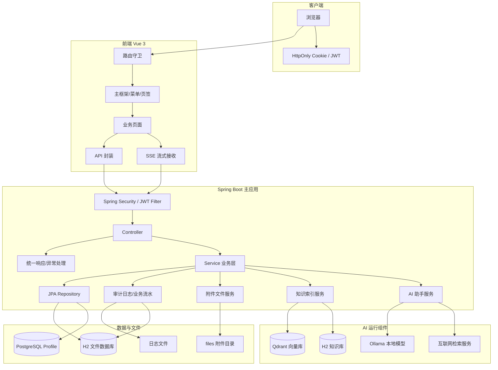
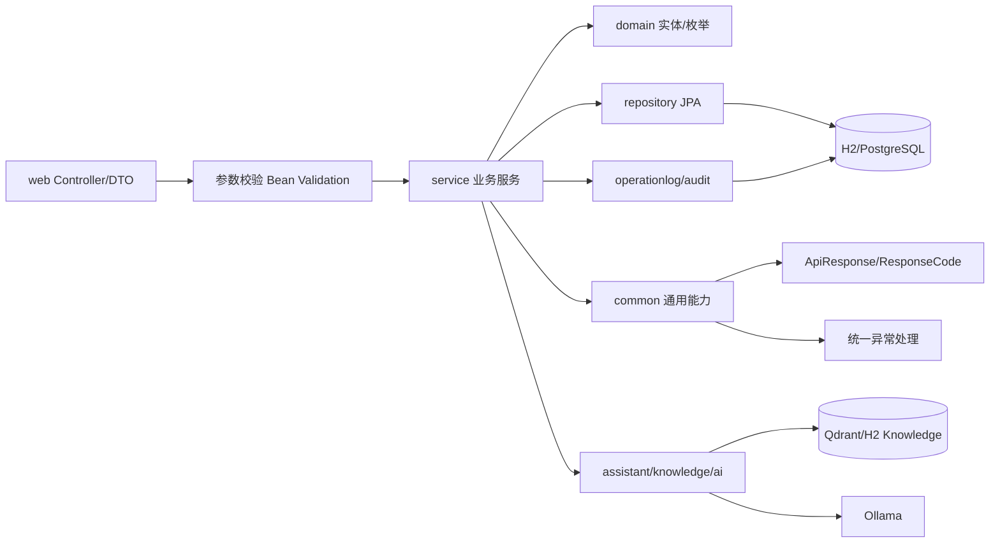
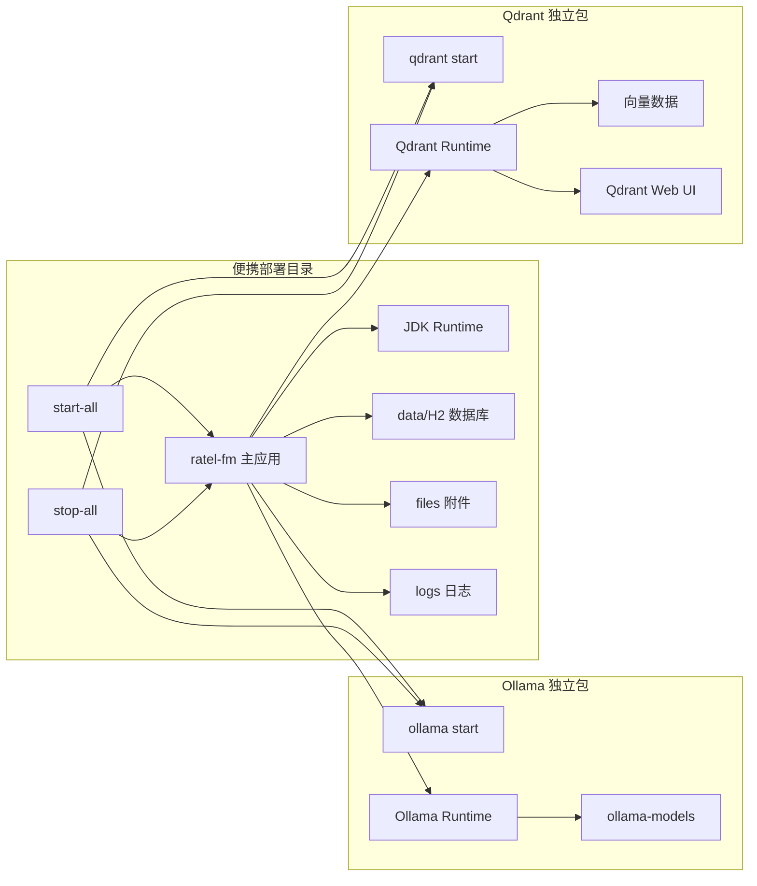

# Ratel FM 技术架构设计文档

版本日期：2026-07-20

开发组织：ratel  
开发人员：WenZhang  
联系方式：18782945613

## 1. 架构概览

Ratel FM 是前后端一体化工程。前端使用 Vue 3、Vite、TypeScript 和 Element Plus，后端使用 Spring Boot、Java 24、Spring MVC、Spring Security、Spring Data JPA。生产部署时前端构建产物进入 Spring Boot 静态资源目录，启动后端即可访问完整系统。

系统围绕以下能力分层：

- 访问层：Vue 页面、路由守卫、API 封装、SSE 流式接收。
- 接口层：Spring MVC Controller、统一响应、统一异常、OpenAPI/Knife4j。
- 业务层：按 auth、basic、finance、operation、inventory、receivable、workflow、assistant 等模块划分 Service。
- 数据层：Spring Data JPA Repository、H2/PostgreSQL 兼容、初始化 SQL 和启动初始化器。
- 安全层：Cookie JWT、登录会话、菜单权限、接口权限码、当前用户上下文。
- AI 层：Ollama 模型服务、Qdrant/H2 知识索引、AI 助手、智能检索、本地知识库、OCR。
- 部署层：主应用包、Ollama 独立包、Qdrant 独立包、Windows/Linux 启停脚本。

## 2. 技术架构图

### 2.1 总体技术架构



### 2.2 后端分层架构设计



### 2.3 前端架构设计

```mermaid
flowchart TB
    App[App.vue] --> Router[router/index.ts]
    Router --> Guard[登录与菜单权限守卫]
    Guard --> Shell[ShellView 主框架]
    Shell --> Menu[动态菜单]
    Shell --> Tabs[多页签]
    Shell --> Header[服务器时间/天气/个人中心]
    Shell --> Views[业务页面 views]
    Views --> Components[公共组件]
    Views --> Api[api/fm.ts]
    Api --> Http[api/http.ts]
    Http --> Backend[/ratel/fm/api]
    Components --> Attachment[AttachmentList]
    Components --> LogDrawer[OperationLogDrawer]
    Components --> AiAssistant[FloatingAiAssistant]
    Components --> WorkflowPreview[WorkflowBusinessFormPreview]
```

### 2.4 部署架构设计



## 3. 技术栈

| 层级 | 技术 |
| --- | --- |
| 后端语言 | Java 24 |
| 后端框架 | Spring Boot、Spring Web MVC、Spring Security |
| 持久化 | Spring Data JPA、Hibernate |
| 数据库 | H2 文件数据库、PostgreSQL profile |
| JSON | Alibaba FastJson2 |
| 接口文档 | OpenAPI、Knife4j |
| 日志 | Logback |
| 前端 | Vue 3、Vite、TypeScript、Element Plus、Pinia |
| 导出 | 后端 Excel 导出服务 |
| AI | Ollama、本地 embedding、Qdrant 或 H2 知识库 |
| 打包 | Maven、Vite、Spring Boot jar、Assembly zip |

## 4. 工程结构

```text
ratel-fm
├── frontend                         # Vue 3 前端工程
│   ├── src/views                    # 页面，按业务模块分目录
│   ├── src/components               # 公共组件、附件、AI、流程、流水
│   ├── src/api                      # 接口封装
│   ├── src/router                   # 路由和菜单编码映射
│   ├── src/stores                   # Pinia 状态
│   ├── src/utils                    # 校验、金额、字典、SSE、菜单使用等工具
│   └── vite.config.ts               # 前端构建配置
├── src/main/java/com/ratel/fm
│   ├── common                       # 统一响应、异常、校验、并发工具
│   ├── config                       # AI、附件、数据库、导出、安全、OpenAPI、Web 配置
│   ├── domain                       # JPA 实体和枚举，按业务模块分目录
│   ├── repository                   # JPA Repository，按业务模块分目录
│   ├── security                     # JWT、过滤器、当前用户上下文、会话校验
│   ├── service                      # 业务服务，按业务模块分目录
│   └── web                          # Controller 和 DTO，按业务模块分目录
├── src/main/resources
│   ├── application*.yml             # 主配置和 profile 配置
│   ├── init.sql                     # PostgreSQL 初始化基线
│   ├── data                         # 会计科目、行政区划等初始化数据
│   └── logback-spring.xml           # 日志配置
├── src/main/package                 # 主应用便携包脚本
├── src/main/ollama-package          # Ollama 独立运行包资源和脚本
├── src/main/qdrant-package          # Qdrant 独立运行包资源、Web UI 和脚本
├── src/main/assembly                # Maven assembly 打包描述
├── tools                            # 测试、冒烟和辅助脚本
├── PA.md                            # 产品设计文档
├── TECH_ARCHITECTURE.md             # 技术架构设计文档
└── AI_PROGRAMMING_LOG.md            # AI 编程原则和处理记录
```

## 5. 后端分层设计

### 5.1 Controller 层

Controller 按业务模块分目录，统一返回 `ApiResponse`。主要入口：

| Controller | 路径 | 职责 |
| --- | --- | --- |
| `AuthController` | `/api/auth`、`/api/users`、`/api/roles`、`/api/menus` | 登录、人员、角色、菜单、个人中心 |
| `BasicDictionaryController` | `/api/basic/dictionaries` | 字典树、启用字典、汇率查询 |
| `FinanceController` | `/api/finance` | 科目、凭证、会计平台、试算平衡 |
| `AccountingPeriodController` | `/api/accounting-periods` | 会计期间、月结检查、关闭和反结账 |
| `CashierController` | `/api/cashier-transactions` | 出纳流水 |
| `OperationController` | `/api/purchase-orders`、`/api/shipments` | 采购、物流 |
| `PhaseTwoController` | `/api/inventory-ledgers`、`/api/ar-ap-bills`、`/api/finance/reports`、`/api/ai/assistant` | 库存、应收应付、三大报表、AI 助手 |
| `WorkflowController` | `/api/workflows` | 审批中心、流程定义、流程配置 |
| `AttachmentController` | `/api/attachments` | 附件上传、改名、删除、下载、预览 |
| `AuditLogController` | `/api/audit/operation-logs` | 数据库操作日志 |
| `InsightController` | `/api/insights`、`/api/search`、`/api/ai/knowledge/rebuild` | 首页概览、智能检索、知识重建 |
| `LocalKnowledgeController` | `/api/ai/local-knowledge` | 本地知识库文档上传、重建、删除 |
| `AiStatusController` | `/api/ai/status` | AI 组件状态 |
| `SystemStatusController` | `/api/system/status` | 服务器时间和天气状态 |

### 5.2 Service 层

Service 层承载业务规则、事务边界、快照、日志和知识索引联动。主要服务：

- `AuthService`：登录、会话唯一性、人员、角色、菜单和个人中心。
- `BasicDictionaryService`：字典树、启停、层级规则、级联数据。
- `FinanceService`：科目、凭证、过账、作废、导出、流水。
- `AccountingPeriodService`：期间创建、月结检查、关账和反结账。
- `CashierService`：出纳流水、确认、取消、导出。
- `OperationService`：采购、物流、状态流转、审批联动、流水。
- `InventoryService`：库存台账、库存校验、物料库存统计。
- `ArApService`：应收应付、收付核销、收付统计。
- `WorkflowService`：流程定义、流程配置、流程实例、任务审批。
- `AttachmentService`：附件元数据、物理文件、预览和下载。
- `BusinessOperationLogService`：业务操作流水。
- `AuditLogService`：数据库审计日志。
- `KnowledgeIndexService`、`KnowledgeSearchService`：知识索引创建和检索。
- `AiAssistantService`、`AiAssistantStreamService`：AI 助手非流式和流式响应。
- `SystemContextService`：AI 助手系统上下文聚合。

### 5.3 Repository 和 Domain 层

实体和 Repository 均按模块分目录。核心领域包括：

- `auth`：用户、角色、菜单、登录会话、菜单使用频次。
- `basic`：基础字典。
- `finance`：会计科目、凭证、凭证明细、来源类型。
- `period`：会计期间。
- `cashier`：出纳流水。
- `purchase`：采购单。
- `logistics`：物流单和物流流水。
- `inventory`：库存台账。
- `receivable`：应收应付和核销记录。
- `workflow`：流程定义、流程配置、流程实例、流程任务、流程操作日志。
- `attachment`：附件文件和业务附件关联。
- `operation`：业务操作流水。
- `audit`：用户关键操作日志。
- `knowledge`：知识文档、本地知识文档。

## 6. 前端架构

### 6.1 页面结构

前端页面按业务模块分目录：

- `auth`：默认登录页和星空登录页。
- `shell`：主框架、左侧菜单、页签、右上角状态和个人中心。
- `dashboard`：首页概览。
- `system`：人员、角色、菜单。
- `basic`：字典管理。
- `finance`：科目、凭证、会计期间、出纳、会计平台、报表。
- `operation`：采购、物流。
- `inventory`：库存台账和物料库存。
- `receivable`：应收应付和收付统计。
- `workflow`：审批中心、流程管理、流程定义。
- `assistant`：AI 助手和 AI 状态。
- `search`：智能检索。
- `audit`：操作日志。
- `error`：不存在路由的兜底页面。

### 6.2 路由和权限

`frontend/src/router/menuRoutes.ts` 维护页面路由与菜单编码映射。前端路由守卫执行：

1. 登录页直接访问。
2. 非登录页检查是否存在令牌。
3. 有令牌时请求 `/api/auth/me` 验证登录状态。
4. 请求授权菜单编码和菜单资源。
5. 有页面权限则进入页面。
6. 无页面权限则跳转首页。
7. 无令牌或令牌无效时弹出登录过期倒计时并跳转登录页。

不存在的路由也进入同一认证和权限逻辑，避免浏览器直接展示后端错误 JSON。

### 6.3 API 封装

`frontend/src/api/http.ts` 统一处理请求、Cookie 携带、错误码、Blob、表单上传和认证失败。`frontend/src/api/fm.ts` 聚合业务接口，并封装 AI 助手 SSE 流式请求。

### 6.4 公共组件

- `AttachmentList`：附件上传、预览、下载、改名、删除。
- `OperationLogDrawer`：业务流水右侧抽屉时间轴。
- `FloatingAiAssistant`：右下角 AI 助手。
- `FloatingVoiceCommand`：语音指令入口。
- `WorkflowBusinessFormPreview`：流程业务表单预览。
- `WorkflowApproverPopover`：审批人组合展示。
- `SystemManual`：系统手册。
- `AmountText`：金额展示。

## 7. 安全架构

### 7.1 Cookie JWT

登录成功后后端写入 `FM_TOKEN` HttpOnly Cookie。JWT Claims 包含用户、身份证、部门、组织、岗位、联系方式、所属公司、权限码、终端类型、终端标识和登录会话 ID。

每次请求由安全过滤器校验：

- Cookie 是否存在。
- JWT 签名是否正确。
- JWT 是否过期。
- 人员是否存在且未禁用。
- 令牌中的人员信息是否与数据库一致。
- 登录会话是否有效。
- 终端类型和终端标识是否一致。

距离过期不足半小时自动刷新 Cookie。

### 7.2 唯一登录

唯一登录维度为所属公司、身份证号、终端类型。后登录可选择强制挤掉旧会话，旧会话状态变为强制下线，后续请求返回对应业务码。

### 7.3 权限控制

权限分两层：

- 前端：按菜单编码控制模块、页面、按钮显隐。
- 后端：按权限码和当前用户上下文兜底校验。

菜单资源统一保存在 `fm_menus`，角色授权保存角色与菜单关系，权限码由菜单绑定的 `permission_code` 推导。

## 8. 数据架构

### 8.1 数据库模式

默认数据库为 H2 文件模式，适合单机部署。PostgreSQL profile 用于需要独立数据库的部署。`init.sql` 作为 PostgreSQL 初始化基线，H2 通过启动初始化器和兼容配置完成初始化。

核心命名规则：

- 数据库字段使用下划线。
- 代码字段使用驼峰。
- 创建时间使用 `created_time`。
- 修改时间使用 `modify_time`。
- 金额字段使用高精度数值，金额和汇率保留 8 位小数。

### 8.2 初始化数据

初始化数据来源：

- `init.sql`：PostgreSQL 表结构、索引、注释和默认数据。
- `data/accounting-subjects.csv`：标准会计科目。
- `data/administrative-divisions.csv`：全国行政区划。
- 启动初始化器：菜单、角色、管理员、默认字典、H2 兼容数据。

数据库结构或初始化数据变更时，需要同步维护 PostgreSQL 和 H2 两套初始化口径。

### 8.3 多账套隔离

业务表通过所属公司字段隔离数据。新增和查询时后端从当前用户上下文读取所属公司，不依赖前端接口参数。

适用模块：

- 首页概览。
- 会计科目、凭证、会计期间、出纳、会计平台。
- 采购、物流、库存、应收应付。
- 审批流程。
- 操作日志。
- 附件和知识索引。

## 9. 日志与审计

### 9.1 文件日志

Logback 负责系统日志和关键操作日志输出。日志按配置滚动、压缩、保留，到期自动删除。文件日志用于数据库审计日志失败时的追溯兜底。

### 9.2 数据库审计日志

数据库操作日志记录操作人、身份证、联系方式、部门、终端类型、终端标识、操作模块、操作功能、参数、结果、响应值和影响说明。日志写入失败不能影响主业务事务。

### 9.3 业务操作流水

凭证、采购、物流、库存、应收应付均有业务操作流水。流水保存状态、操作类型、操作人、操作时间、快照字段和业务影响，用于右侧抽屉时间轴展示。

## 10. 附件架构

附件采用统一管理：

- `fm_attachments` 保存文件名、后缀、大小、类型、上传人、路径等元数据。
- `fm_business_attachments` 保存业务类型、业务 ID 和附件 ID。
- 物理文件存储在运行包 `files` 目录下。
- 所属公司作为最上层目录。
- 下载和预览统一通过后端接口鉴权。

## 11. AI 与知识库架构

### 11.1 AI 组件

Ratel FM 的 AI 能力由主应用、Ollama 和可选 Qdrant 组成：

- 主应用：负责业务上下文、权限过滤、提示词组织、SSE 输出、知识检索。
- Ollama：负责本地聊天、embedding、OCR 或视觉模型调用。
- Qdrant：可选向量数据库，用于知识向量检索。
- H2 知识库：轻量内置检索存储，可作为 Qdrant 替代或降级方案。

### 11.2 知识索引

知识来源：

- 系统模块说明。
- 会计科目。
- 凭证、采购、物流、库存、应收应付。
- 附件文本。
- 用户上传的本地知识库文档。
- 初始化基础数据。

索引规则：

- 新增或修改核心业务数据后应同步更新知识索引。
- 检索前必须按所属公司和权限过滤。
- Qdrant 和 H2 由配置开关选择。
- embedding 使用本地 Ollama 模型。

### 11.3 AI 助手

AI 助手支持非流式和 SSE 流式接口。流式输出在权限过滤、系统上下文和知识上下文准备完成后开始。服务端提供并发、超时、心跳和客户端取消保护。

对话上下文只辅助理解追问，不作为实时业务事实依据。金额、状态、库存、审批结果等必须重新检索系统数据。

### 11.4 互联网检索

互联网检索通过独立服务封装。API Key 只能通过环境变量或外置安全配置注入，禁止写入源码、README、PA 或打包配置。

### 11.5 业务 Agent

业务 Agent 通过 `POST /api/agent/business` 提供统一入口，Controller 位于 `web/agent`，Service 位于 `service/agent`，DTO 位于 `web/dto/agent`。接口权限为 `AI_ASSISTANT_USE`。

当前 Agent 采用“一个入口、多类能力”的架构：

- 前端入口：`AssistantView` 的“业务 Agent”Tab，以及采购、库存、应收应付、会计平台页面的“Agent 分析”按钮。
- 前端调用：`frontend/src/api/fm.ts` 暴露 `api.businessAgentEnabled()` 和 `api.runBusinessAgent()`；后者在 `agentEnabled=false` 时直接阻断，不请求后端 Agent 接口。
- 意图联动：ratel助手问答完成后按关键词识别对账、到期、制证建议、库存风险意图，并调用 `BusinessAgentPanel.runAgent()`。
- 模块分析：采购、物流、库存、应收应付、财务、审批。
- 能力分析：查询型、对账检查、凭证建议、到期提醒、流程助手、库存风险、经营分析、附件/知识问答。
- 阶段控制：`readOnly`、`draft`、`controlled`、`multiStep`。

业务 Agent 复用现有业务 Service，不直接访问数据库写入：

- `OperationService`：采购和物流查询。
- `InventoryService`：库存流水和物料库存统计。
- `ArApService`：应收应付和到期风险。
- `FinanceService`：凭证查询和制证状态。
- `CashierService`：出纳流水和资金制证状态。
- `WorkflowService`：审批待办、发起流程和节点信息。
- `KnowledgeSearchService`：附件文本、本地知识库和业务知识索引召回。

安全原则：

- `/api/ai/status` 返回 `agentEnabled`，前端据此隐藏业务 Agent 入口并阻止 Agent 调用。
- Agent 总开关关闭时，`BusinessAgentService` 不选择模块、不调用业务 Service、不返回业务证据，只返回禁用说明。
- 所有读取必须经过当前用户权限和所属公司隔离。
- 未授权模块不返回业务证据。
- `draft` 只生成草稿说明，`controlled` 和 `multiStep` 只生成不可执行计划。
- 没有确认令牌、Agent 审计表、工具白名单和服务端二次校验前，任何写操作计划都必须 `executable=false`。

## 12. 审批流程架构

审批由流程定义、流程配置、流程实例、流程任务和流程操作日志组成。

流程发起步骤：

1. 业务模块按功能模块代码查询当前所属公司的流程配置。
2. 找到启用流程定义后生成流程实例。
3. 根据节点审批人配置生成任务。
4. 审批人处理任务，写入流程操作日志。
5. 流程完成后回调或更新业务单据状态。

审批人支持：

- 指定人员。
- 部门。
- 部门 + 岗位。

采购管理当前已经和流程审批联动，后续其他业务模块可复用同一流程配置方式。

## 13. 导出架构

导出由后端统一 Excel 导出服务处理。支持：

- 按选中行导出。
- 未选中时按搜索条件导出。
- 最大导出行数由配置控制。
- 导出字段与列表展示字段保持一致。

已接入模块包括凭证、采购、物流、库存、应收应付、收付统计、出纳等。

## 14. 部署架构

### 14.1 主应用包

主应用便携包包含：

- Spring Boot jar。
- 前端静态资源。
- 内置 JDK。
- H2 模板库。
- Windows 启动、关闭、状态脚本。
- Linux 启动、关闭、状态脚本。
- HTTPS 证书生成和安装辅助脚本。

启动后通过统一基础路径 `/ratel/fm` 访问。

### 14.2 Ollama 独立包

Ollama 独立包包含：

- Windows/Linux Ollama 运行时。
- Python/Open WebUI 相关运行资源。
- 模型仓库映射。
- 独立启动和关闭脚本。

工程根目录 `ollama-models` 是实际模型仓库来源。除非 Ollama 模型或运行包变化，否则不需要每次重新打包 Ollama。

### 14.3 Qdrant 独立包

Qdrant 独立包包含：

- Windows/Linux Qdrant 运行时。
- Qdrant Web UI 静态资源。
- 独立启动、关闭、状态脚本。

Qdrant 可部署在本机或其他电脑。跨电脑部署时需要确认监听地址、防火墙、端口和主应用配置。

### 14.4 总启停脚本

主应用包提供总启动和总关闭脚本，可分别启动或关闭 ratel-fm、Ollama、Qdrant。三个组件启动/关闭互不影响，某个组件失败不应阻断其他组件。

## 15. 配置架构

主要配置文件：

- `application.yml`：默认配置。
- `application-postgres.yml`：PostgreSQL profile。
- `application-h2-template.yml`：H2 模板库生成。
- `application-aot.yml`：AOT 构建配置。
- `logback-spring.xml`：日志滚动和保留配置。

配置分类：

- 服务端口、上下文路径、静态资源。
- 数据源和 JPA。
- JWT、安全、Cookie。
- 附件目录和限制。
- 导出最大行数。
- AI 模型、Ollama、Qdrant、embedding、互联网检索。
- 天气和定位兜底地区。
- 日志路径和保留时间。

所有可注释配置文件应说明用途、默认值来源、运行边界和安全注意事项。

## 16. 运行和打包原则

编码、注释、打包和 AI 编程记录原则统一维护在 `AI_PROGRAMMING_LOG.md`。当前执行原则：

- 除非用户明确要求，不默认执行完整打包。
- 用户明确要求打包时，按主应用、Qdrant、Ollama 顺序执行，避免 Maven AOT 临时目录冲突。
- Ollama 打包耗时较长，只有 Ollama 相关内容变化时才重新打包。
- 构建产物位于 `target`，可随时重新生成，不应作为源码依赖。

## 17. 关键质量要求

- 所有接口统一返回 `ApiResponse`。
- 所有关键操作需要文件日志和数据库审计日志。
- 数据库审计日志失败不能影响业务主流程。
- 前后端校验都必须存在，后端兜底。
- 树型数据默认只展开第一层。
- 列表默认按修改时间倒序。
- 金额计算统一 8 位小数。
- 业务快照必须同步进入查看流水。
- AI 回答必须尽量基于引用来源，缺少来源时明确说明无法确认。

## 18. 后续演进建议

- 将数据库结构变更从 JPA 自动更新逐步迁移到 Flyway 或 Liquibase。
- 给核心业务服务补充单元测试和集成测试。
- 增加 Qdrant、Ollama 远程部署连通性诊断页面。
- 为知识索引增加可视化重建范围和失败重试。
- 审批流程可进一步引入 BPMN 可视化设计器，但当前轻量流程模型已能支撑现有采购审批。
